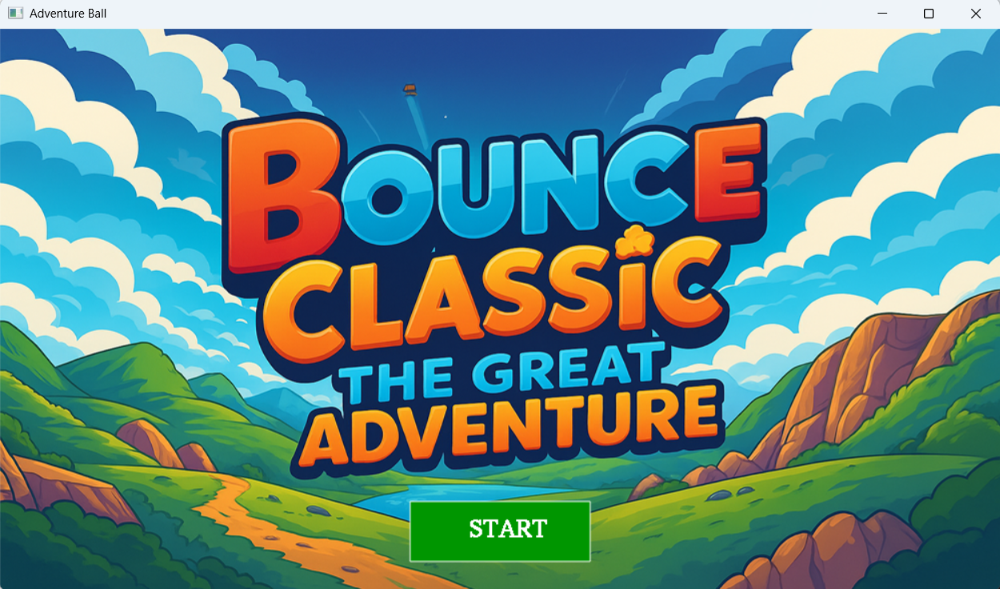
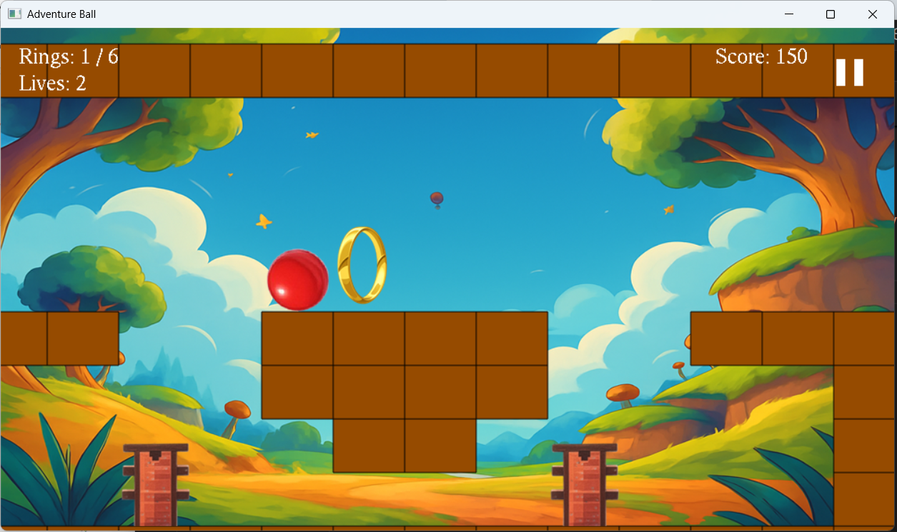
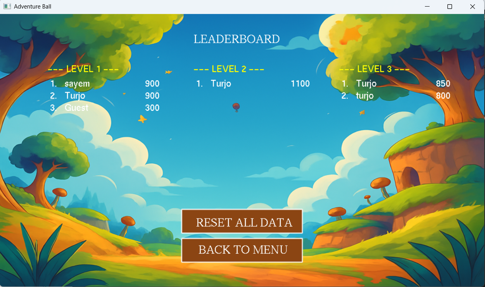
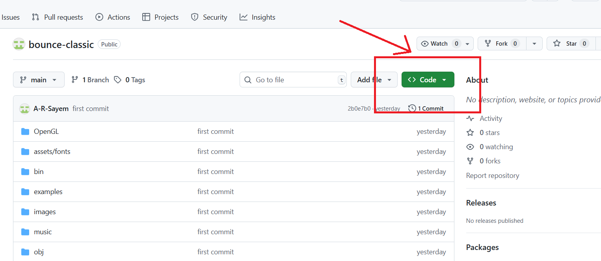
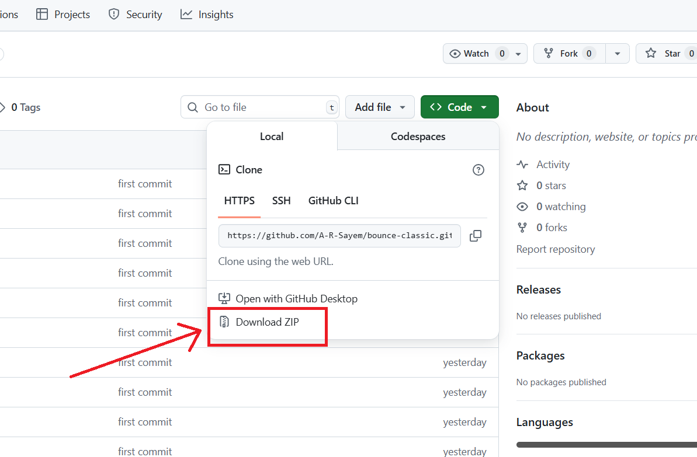
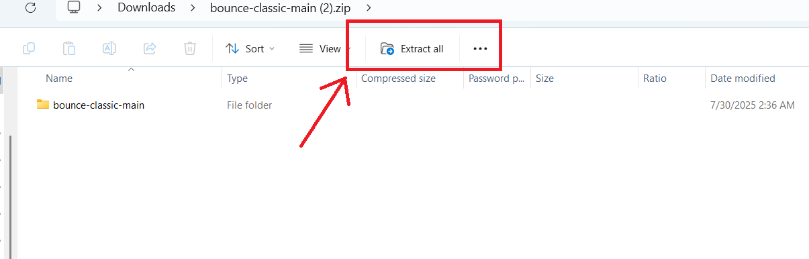
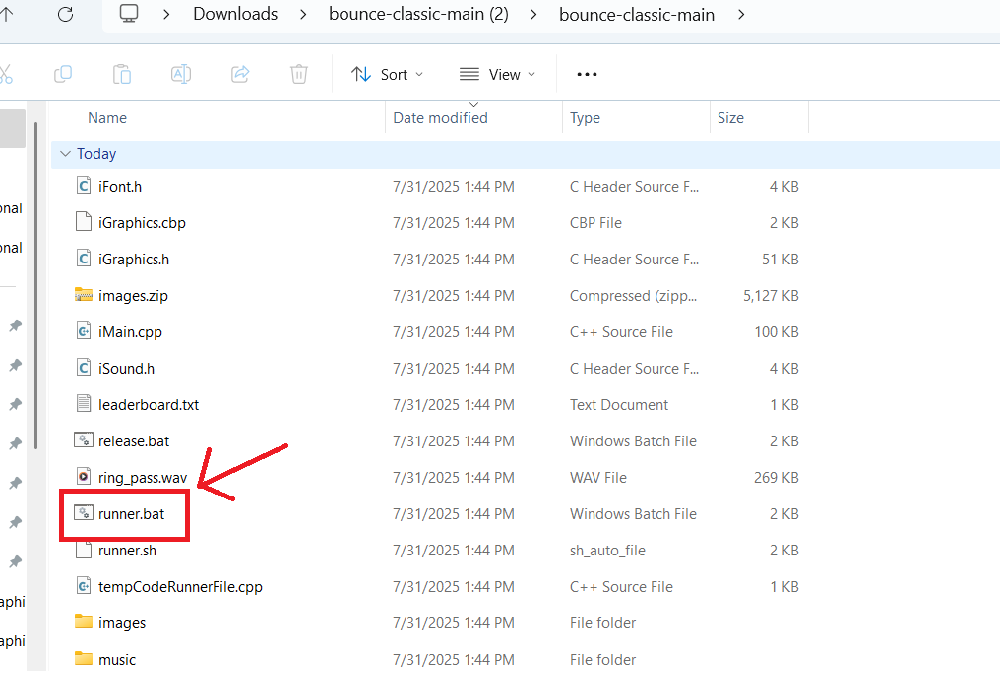
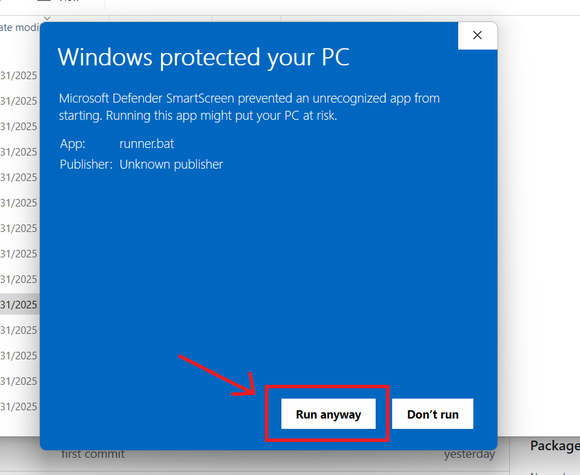
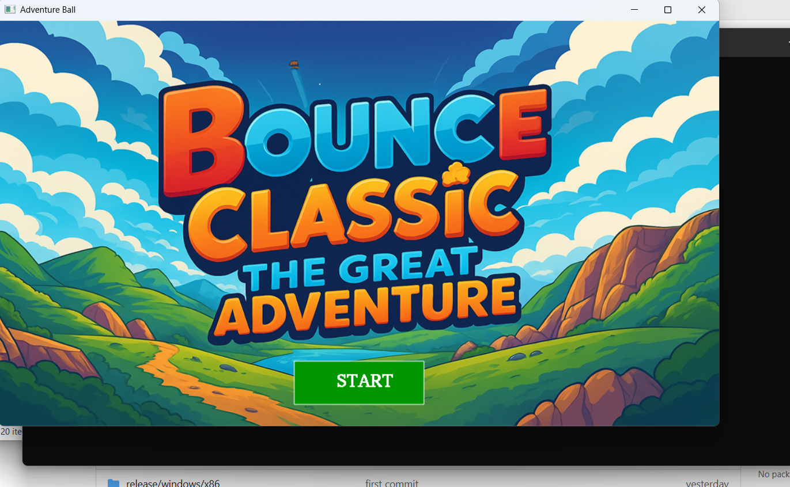

   <h1> Bounce Classic - The Grand Adventure 🎮</h1>
   
"Adventure Ball" is a 2D platformer game built with C and the iGraphics library. The game challenges players to navigate a bouncing ball through various levels, collecting rings and avoiding obstacles to reach the finish line.

## 🖼️ Game Screenshots

### 🎬 Splash Screen

### 🕹️ Gameplay

### 📊 Leaderboard

---

## 🧩 Game Features

- **🎮 Three Unique Levels:**  
  The game includes three distinct and progressively challenging levels, each with its own layout of platforms, obstacles, and collectibles.

- **🧠 Physics-Based Movement:**  
  The ball's movement is controlled by a simple but effective physics engine, featuring gravity, acceleration, friction, and jumping.

- **⚠️ Interactive Obstacles:**  
  Levels are populated with various hazards, including static spikes and vertically moving arrows that challenge the player's timing and skill.

- **💍 Ring Collection System:**  
  Players are encouraged to explore each level to collect rings. A certain percentage of rings must be collected to unlock the finish point.

- **⭐ Scoring and Lives System:**  
  The game tracks player score based on collecting rings and progressing through the level.  
  Players start with a set number of lives, which are lost upon hitting hazards or falling off the map.

- **🏆 Persistent Leaderboard:**  
  The game features a persistent leaderboard that saves player names and high scores for each level to a local file (`leaderboard.txt`).

- **📋 Full-Featured Menu System:**  
  A comprehensive menu system allows players to:
  - Start the game  
  - Select a level  
  - View instructions  
  - See developer credits ("About Us")  
  - Adjust settings (toggle music and sound effects)  
  - View the leaderboard  
  - Quit the game  

- **🎵 Sound and Music:**  
  The game includes background music and sound effects for actions like jumping, collecting rings, and getting hit.  
  Players can toggle these sounds in the settings.

- **⏸️ Pause and Game Over States:**  
  Players can pause the game at any time.  
  A **"Game Over"** screen is displayed when all lives are lost, showing the final score.

## 🎮 How to Play

### 🕹️ Controls
- **Move Left:** `A` key  
- **Move Right:** `D` key  
- **Jump:** `W` key

## 🎯 Objective

- **Navigate the Ball:**  
  Control the ball to move left, right, and jump through the level.

- **Collect Rings:**  
  Gather the glowing rings scattered throughout each level.  
  You must collect at least **70%** of the rings to be able to finish the level.

- **Avoid Hazards:**  
  Stay away from **spikes** and **moving arrows**.  
  Hitting a hazard or falling out of the world will cost you a life.

- **Reach the Finish:**  
  Once you have collected enough rings, make your way to the **red finish block** to complete the level.

- **Get a High Score:**  
  Your score increases as you collect rings and travel through the level.  
  Try to finish with the highest score possible to make it onto the **leaderboard**!

  ## 📥 How to Download & Run

Follow these simple steps to download and start playing the game:

### 1️⃣ Click on the **Code** button  

---

### 2️⃣ Click on **Download ZIP**  

---

### 3️⃣ Unzip the downloaded file  

---

### 4️⃣ Double-click on the `runner.bat` file  

---

### 5️⃣ If asked, grant **permission to run** the file  
_(Windows may show a security popup)_  

---

### 6️⃣ The game is now running – **Yayyy!** 🎉🎮  

